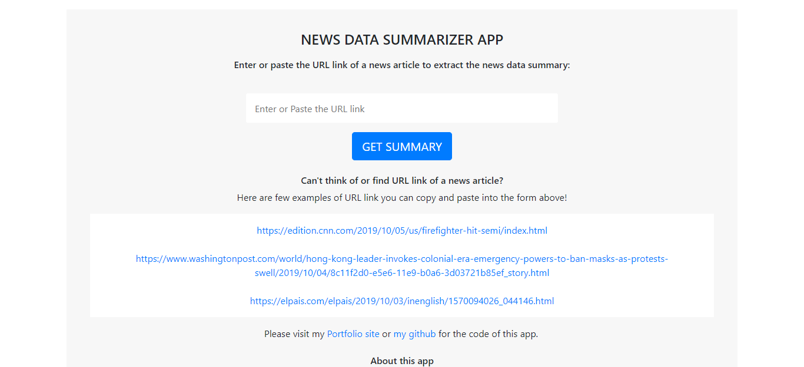

# News Summarizer App using Python

News Summarizer App using <strong>Python</strong>, <strong>newspaper3k</strong> and <strong>nltk</strong> to scrape and extract news data from from a given URL using <strong>requests</strong> and transform and load the extracted data using <strong>WTforms</strong>, <strong>WordCloud</strong> and <strong>Flask</strong> 

<a href="https://newssummarizer.herokuapp.com/" target="_blank">View Demo</a>

## About the Project



Previously I built a simple <a href="https://pythonnewsscraper.herokuapp.com/" target="_blank">News Scraper APP</a> on the web using <strong>Python</strong> to scrape the latest news from a specific news site using <strong>Beautiful Soup</strong> and <strong>Flask</strong>.
                
This time, I built slightly more advanced version of the app to scrape news data from a news article using <strong>Python</strong> packages <strong>newspaper3k</strong> and <strong>nltk</strong>, then deployed the app using <strong>Flask</strong> and on <strong>heroku</strong>.

First of all, when the URL link form above captures the URL link of a news article, the <strong>newspaper3k</strong> package will extract and parse the data of the article. For form input handling and validation, I used <strong>WTForms</strong> and <strong>requests</strong> libraries to grab the URL link entered in the form. Then, from the data extracted I extract following data to render on the first part of my result page:

<strong>Title</strong><br>
<strong>Published date</strong><br>
<strong>Author</strong><br>
<strong>Top image (source link)</strong>
                        
At the same time, using the full text of the article extracted, my app also generates <strong>WordCloud</strong> for the news article. The WordCloud on the result page will display the words that are the most frequent among the news text extracted.<strong>io</strong> library is used to keep the WordCloud image in memory and <strong>base64</strong> to convert the resulting bytes to base64 in order to return the image as part of our HTML response and render the image.
                    
Lastly <strong>nltk</strong>, the Natural Language Toolkit and its sentence tokenizer tokenizes
the article text to produce the summary of the article.

<strong>Keywords (WordCloud image)</strong><br>
<strong>Summary</strong><br>

Keywords(WorldCloud) image and the summary of the news text will be displayed as the second part
of the result page.


## Getting Started

Everytime my news scraper app website built with Flask gets loaded, the live news site El Paris English site (in the pic below) gets scraped with Python library Beautiful Soup.


```python
import requests
from bs4 import BeautifulSoup

r1 = requests.get("https://elpais.com/elpais/inenglish.html")
coverpage = r1.content

soup1 = BeautifulSoup(coverpage, 'html5lib')

coverpage_news = soup1.find_all('h2', class_='articulo-titulo')
```
the code above returns the raw data of all the news articles that is currently displayed on the site as follows:


From the data above, I cleaned the data and extracted the title and the link of each articles currently displayed, then I did the same for different section of the web to scrape the news category of each news article.

Then using Flask and ninja, I extract the data of the latest top 5 news articles and get them displayed on my news scraper app.


